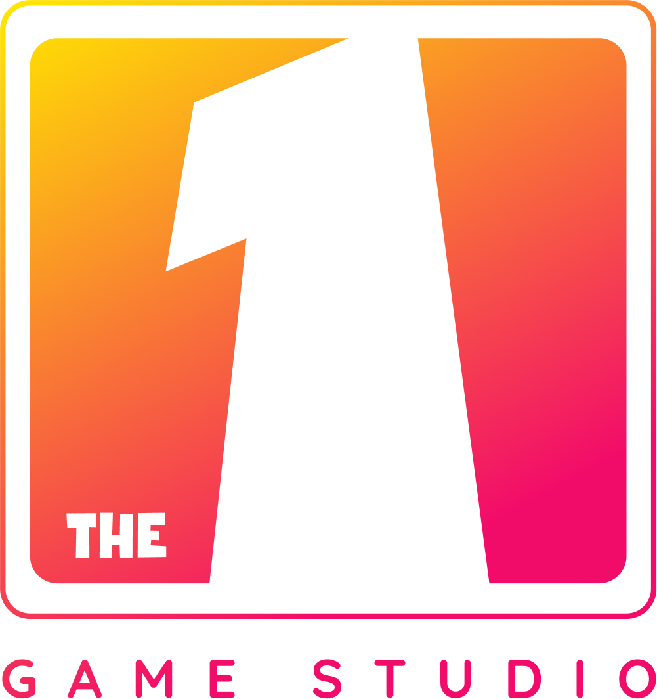

# Unity Optimization Tools

**Comprehensive optimization toolkit for Unity projects**

## 🎯 Features

### 📦 Optimization Hub Window
Centralized optimization dashboard with multiple analysis modules:

- **Overview Module** - Project-wide health check and statistics
- **Texture Module** - Texture compression, atlas generation, and size analysis
- **Shader Module** - Shader variant analysis and material tracking
- **Mesh Module** - 3D mesh optimization and poly count reduction
- **Audio Module** - Audio clip compression and format optimization
- **Font Module** - Font asset optimization
- **Material Module** - Material instance consolidation
- **Addressables Module** - Asset bundle analysis and optimization
- **Animation Module** - Animation clip optimization
- **Reports Module** - Build size reports and optimization suggestions

### 🛠️ Key Tools

#### Texture Optimization
- **TinyPNG Integration** - Automated lossy compression with API integration
- **Atlas Generation** - Create sprite atlases from folder structures
- **Format Conversion** - Batch convert textures to optimal formats
- **Compression Analysis** - Identify oversized textures

#### Shader Analysis
- **Variant Tracking** - Monitor shader variant counts
- **Material Mapping** - Track shader usage across materials
- **Shader Replacement** - Bulk replace shaders with optimized alternatives
- **Complexity Analysis** - Identify performance-heavy shaders

#### Addressables Tools
- **Group Management** - Organize assets into addressable groups
- **Dependency Analysis** - Visualize asset dependencies
- **Bundle Size Tracking** - Monitor bundle sizes over time

## 📋 Requirements

- Unity 2021.3 or higher
- Addressables Package 1.19.0+
- Cysharp.UniTask 2.3.0+
- TheOne Template Editor 1.0.0+

## 📥 Installation

### Via UPM Registry (Recommended)

Add to your \`Packages/manifest.json\`:

\`\`\`json
{
  "dependencies": {
    "com.theone.tool.optimization": "1.0.0"
  },
  "scopedRegistries": [
    {
      "name": "TheOne Studio",
      "url": "https://upm.the1studio.org",
      "scopes": ["com.theone"]
    }
  ]
}
\`\`\`

### Via Git URL

\`\`\`json
{
  "dependencies": {
    "com.theone.tool.optimization": "https://github.com/The1Studio/UnityOptimizationTools.git"
  }
}
\`\`\`

### Manual Installation

1. Download the latest release
2. Extract to \`Packages/com.theone.tool.optimization/\`
3. Unity will automatically import the package

## 🚀 Quick Start

### Opening the Optimization Hub

**Menu**: \`TheOne → Optimization Hub\` or \`Window → TheOne → Optimization Hub\`

### Basic Workflow

1. **Overview** - Get project health score and identify issues
2. **Module Selection** - Choose specific area to optimize (Textures, Shaders, etc.)
3. **Analysis** - Click "Analyze" or "Refresh" to scan assets
4. **Review** - Examine findings in table/list view
5. **Optimize** - Use built-in tools or export reports
6. **Verify** - Re-analyze to confirm improvements

## 📚 Documentation

See [OPTIMAL_ARCHITECTURE.md](./OPTIMAL_ARCHITECTURE.md) for detailed architecture documentation.

## 📄 License

This project is licensed under the MIT License - see the [LICENSE](LICENSE) file for details.

## 🏢 About The One Studio

**The One Studio** is a mobile game development company specializing in hypercasual and casual games.

- Website: [https://the1studio.com](https://the1studio.com)
- Email: contact@the1studio.com

## 🔗 Related Packages

- [UITemplate](https://github.com/The1Studio/UITemplate) - Comprehensive Unity UI framework
- [TheOne Features](https://upm.the1studio.org) - Modular feature packages

## 📞 Support

- [GitHub Issues](https://github.com/The1Studio/UnityOptimizationTools/issues)
- [Documentation](https://github.com/The1Studio/UnityOptimizationTools#readme)

---

Made with ❤️ by **The One Studio**

